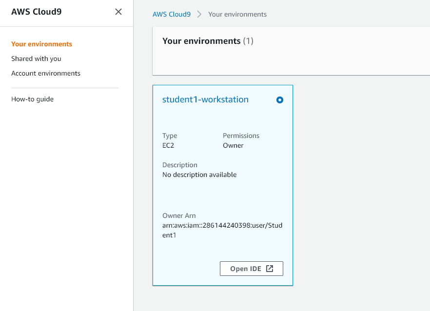
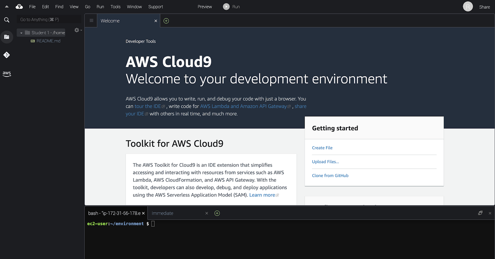
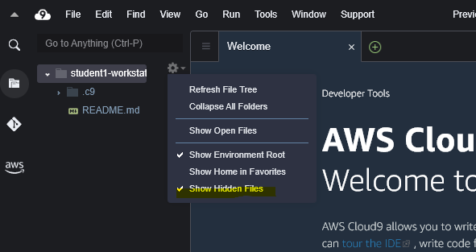
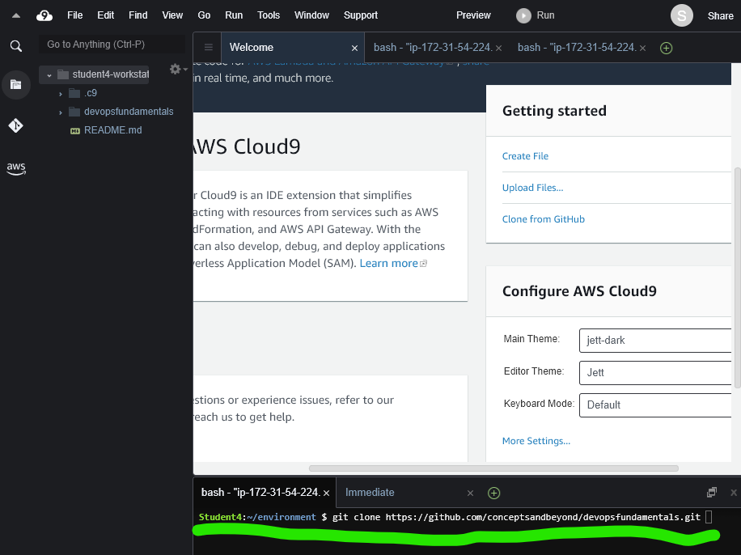

# DevOps Practitioner Lab 0 - Pre-Requisite (~ 30 minutes)
<p> 

## <b>**Setting up your Cloud9 environment**</b>
1. Use a browser to go to  </br> https://console.aws.amazon.com/cloud9/home?region=us-east-1#
2. use the account id: 286144240398
3. Use the login <username> and <password> to log in. 
4. You will see an AWS management console, In the service search for Cloud9, click on the cloud9 services
5. You will see an environment created for you already. similar to below.

     

6. You will see a card with the AWS cloud 9 environment.

7. Click on the Open IDE Button, It should open your IDE. Similar to below.

   

8. Click on Settings wheel in the directory and click on show hidden files.</p>

   


## Create your Git branch
1. Clone the repository if not done already. Run the following commands on the terminal window of your cloud9.

   

``` 

git clone https://github.com/conceptsandbeyond/devopsfundamentals.git

cd devopsfundamentals/

```

2. Create a new feature branch based on the base branch.Change Student0 to match with your login username (Team number). Run following commands in your terminal window.

```
 git checkout base

git checkout -b feature/Student<team number> base

```


## Run The application Locally

3. On  your terminal window,  run the following command to build the package locally
```
./mvnw package
```
let the Java package command complete, then move on to next step

4. Run the application by running the following command. 
``` 
java -jar target/*.jar
```
<b>Leave the application running and Open the new terminal window for the next step.</b>

5. Once the application starts running, you can preview it by accessing it over your workstations’ public IP. Get your public IP by running the following command.
 ```
 curl http://169.254.169.254/latest/meta-data/public-ipv4
 ```

6. On a new browser window open the following URL to preview your application. Replace the IP address by the one you found in previous step.
```
(http://<replace it with public ip>:9090/) 

```
you should see the Spring PetClinic website running.

7.<b> Optional </b>. Alternatively, You can also run the following command on your terminal window.
curl  
```
http://localhost:9090

```
It should return the html body

