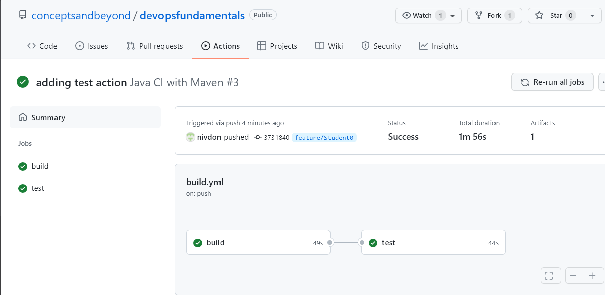
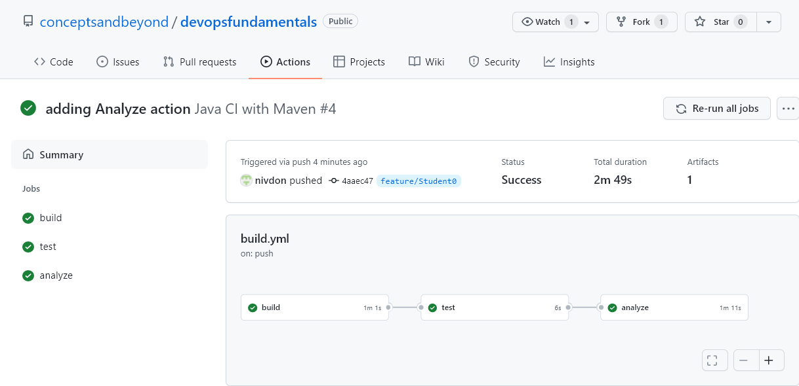

# **DevOps Practitioner Lab 2 (~30 minutes)**
## ***Setting up your CI Pipeline using GitHub Actions***
In this lab you will set up the continuous testing and analysis steps for your CI pipeline. For our demo we will be using Sonar Cloud. SonarCloud helps you assess your code health and build applications with clean, safe code. Detect Bugs & Vulnerabilities & get instant feedback. Integrates w/ your DevOps platform.
<P>Please Note that this lab is dependent on Lab 1 and is to be built in continuation. </p>
<P>Please check -</p>

* That you are on the feature/Student```<your number>``` branch. 

* That you have created a .github/workflows/build.yml file.

* That you have one successful GitHub Actions workflow run.

## **Add Continuous Testing**
1. You will now add continuous testing to your pipeline. In this step you would want to continuously test the automated tests you create as you build new features
2. In our example we are going to run unit tests. Open your .github/workflows/build.yml file.
3. Copy paste the following content at the end of the file.
```
test:
    runs-on: ubuntu-latest
    needs: [build]
    steps:
      - uses: actions/checkout@v2
        with:
          fetch-depth: 0       

      - name: Set up JDK 11
        uses: actions/setup-java@v2g
        with:
          java-version: '11'
          distribution: 'adopt'
          cache: maven

    - name: Build with Maven Wrapper
        run: ./mvnw test
```
4. Push the code
```
git add .
git commit -m "adding build action"
git push 
username- enter Student<your number>
password enter the Personal access token provided to you.
```
5. Check github actions workflow to see the continuous testing step added

     
## **Add Analysis Step**
1. Sonar cloud project is already configured for your repository.  See [here](https://sonarcloud.io/) for more details on how to configure Sonar
2. In this example we are going to use maven to submit the application for Sonar analysis. Open your .github/workflows/build.yml file.

3. Copy paste the following content at the end of the file.
```
 analyze:
    runs-on: ubuntu-latest
    needs: [test]
    steps:
      - uses: actions/checkout@v2
      
      - name: Cache SonarCloud packages
        uses: actions/cache@v1
        with:
        
          path: ~/.sonar/cache
          key: ${{ runner.os }}-sonar
          restore-keys: ${{ runner.os }}-sonar

      - name: Cache Maven packages
        uses: actions/cache@v1
        with:
          path: ~/.m2
          key: ${{ runner.os }}-m2-${{ hashFiles('**/pom.xml') }}
          restore-keys: ${{ runner.os }}-m2

      - name: Build and analyze
        env:
          GITHUB_TOKEN: ${{ secrets.GITHUB_TOKEN }}  # Needed to get PR information, if any
          SONAR_TOKEN: ${{ secrets.SONAR_TOKEN }}
        run: mvn -B verify org.sonarsource.scanner.maven:sonar-maven-plugin:sonar -Dsonar.projectKey=conceptsandbeyond_devopsfundamentals
```
Push the code
```
git add .
git commit -m "adding Analyze action"
git push 
```
>*username- enter Student* <mark>your number </mark> 

>*password enter the Personal access token provided to you.*
5. Check github actions workflow to see the continuous testing step added

      


